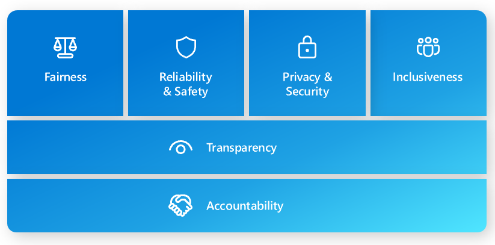

# Azure OpenAI Content Filtering Demo



This project demonstrates the use of Azure OpenAI's content filtering capabilities as part of Microsoft's Responsible AI initiative.

## Installation

1. **Configuration**: 
   - Configure the Azure OpenAI content filters and severity thresholds (low, medium, high) at the resource level.

2. **Deployment Association**: 
   - Once a new configuration is created, associate it with one or more deployments.

## Running the Project

Before running the project, ensure that you have set the necessary environment variables for the Azure OpenAI endpoint and key.

1. **Set Environment Variables:** You need to set the following environment variables:
    - `AZURE_OPENAI_ENDPOINT`: The endpoint for the Azure OpenAI service.
    - `AZURE_OPENAI_KEY`: The key for the Azure OpenAI service.

2. **Build the Project:** Navigate to the project directory in your terminal and run the following command to build the project:
    ```bash
    mvn clean install
    ```

3. **Run the Project:** After the build is successful, you can run the project using the following command:
    ```bash
    java -cp target/myproject-1.0-SNAPSHOT.jar com.example.myproject.Example
    ```
Replace `myproject` and `com.example.myproject` with your actual project name and package.

Remember to replace the placeholders with actual content.

## Features

- Azure OpenAI SDK: Interact with the GPT-4 model using Azure's SDK.
- Content Filtering: Demonstrate how to filter content using Azure OpenAI's capabilities.
- Logging: Track the application flow with detailed logging.